# Using the Admin Interface

This guide covers the essential operations for using the CRUDAdmin interface in your daily workflow. You'll learn how to navigate the dashboard, manage records, search and filter data, and work with forms effectively.

## Prerequisites

Before using the admin interface, ensure you have:

- A configured CRUDAdmin instance with models registered (see [Adding Models](adding-models.md))
- Admin user credentials (see [Managing Admin Users](admin-users.md))
- Access to your admin interface (typically at `/admin`)

---

## Dashboard Navigation

### Accessing the Admin Interface

1. **Navigate to your admin URL**: Go to `/admin` (or your configured mount path)
2. **Login**: Enter your admin credentials
3. **Dashboard loads**: Main interface with sidebar navigation and content area

### Understanding the Dashboard Layout

The admin interface is organized into clear sections:

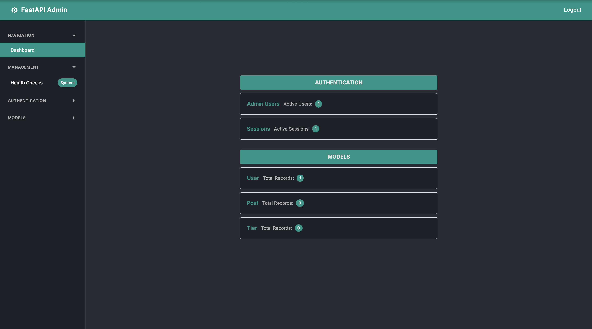

#### Sidebar Navigation

The left sidebar contains collapsible sections:

- **Navigation**: Dashboard overview with system statistics
- **Authentication**: Admin Users and Sessions management
- **Models**: Your registered models with record counts
- **Management**: Health checks and event logs (if enabled)

#### Main Content Area

- **Dashboard**: Overview cards showing model statistics
- **Model pages**: List, create, and edit interfaces for each model
- **Management tools**: System monitoring and audit features

### Navigating Between Models

1. **Click any model** in the sidebar (e.g., "User", "Product")
2. **View the model list** with all records
3. **Use action buttons** to create, edit, or delete records

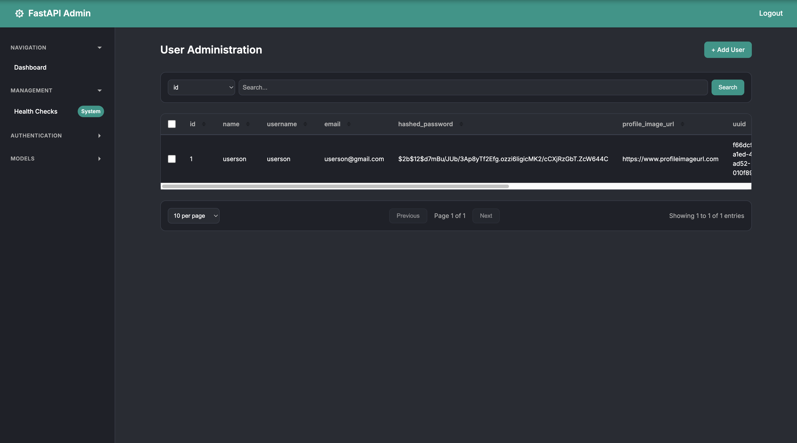

---

## Data Management

### Creating New Records

#### Step 1: Access Create Form

- Click **"+ Add [ModelName]"** button on any model list page
- Form opens with fields based on your Pydantic schema

#### Step 2: Fill Required Fields
Forms include different field types automatically generated from your schemas:

- **Text inputs**: Username, description, notes
- **Email fields**: With built-in email validation
- **Select dropdowns**: For choice fields like roles or status
- **Checkboxes**: For boolean fields like "active" or "featured"
- **Date/time pickers**: For datetime fields

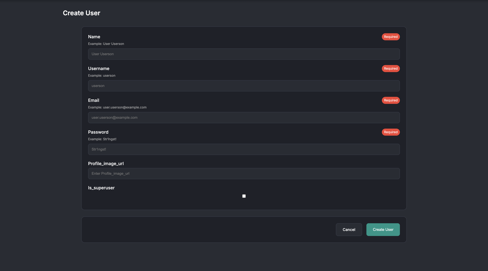

#### Step 3: Submit or Cancel

- **Create**: Saves the record and returns to list
- **Cancel**: Returns to list without saving
- **Validation errors**: Show immediately with helpful messages

### Viewing and Sorting Records

#### List View Features

- **Table display**: All model fields in columns
- **Record counts**: Total number of records shown
- **Sortable columns**: Click headers to sort ascending/descending
- **Pagination**: Navigate large datasets efficiently

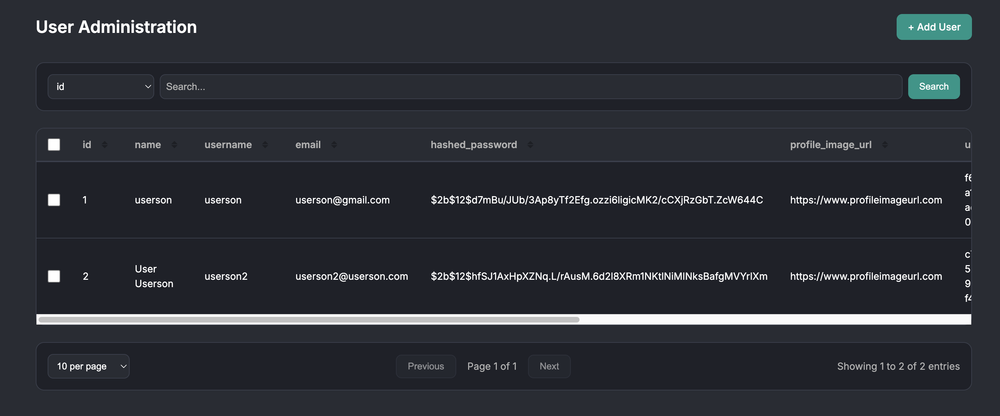

#### Sorting Data

1. **Click any column header** to sort by that field
2. **Click again** to reverse the sort order
3. **Sort indicators** show current direction (▲ asc, ▼ desc)

### Updating Existing Records

#### Step 1: Select Record

- **Check the checkbox** next to the record you want to edit
- **Update button** appears in the action bar

#### Step 2: Edit Fields

- Click **"✎ Update"** to open the edit form
- **Current values** are pre-filled in all fields
- **Modify only** the fields you want to change

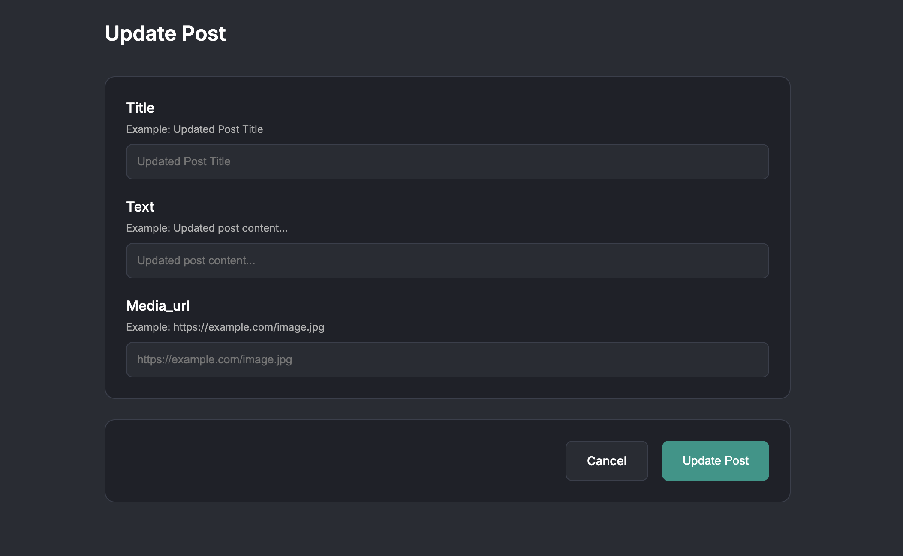

#### Step 3: Save Changes

- **Update**: Saves changes and returns to list
- **Cancel**: Discards changes and returns to list

### Deleting Records

#### Single Record Deletion

1. **Select one record** using its checkbox
2. **Click "🗑 Delete Selected"** button
3. **Confirm deletion** in the dialog that appears

#### Bulk Deletion

1. **Select multiple records** using checkboxes
2. **Click "🗑 Delete Selected"** button  
3. **Confirm bulk deletion** for all selected items

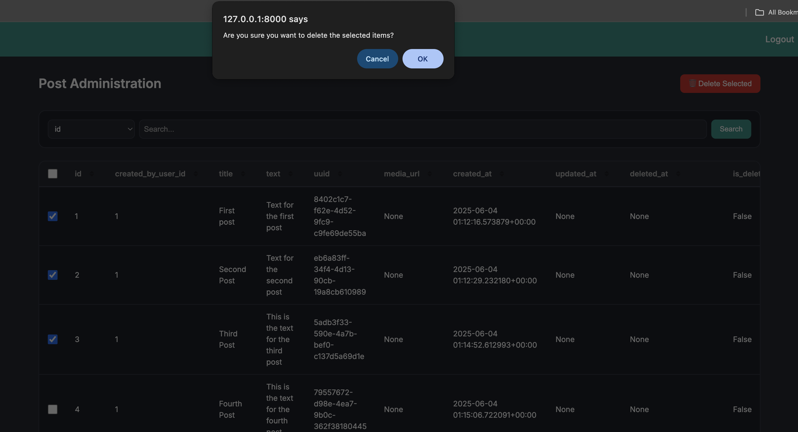

**Note**: The action buttons change dynamically:

- **No selection**: Only "Add" button visible
- **One selected**: "Update" and "Delete" buttons appear
- **Multiple selected**: Only "Delete" button appears (bulk operation)

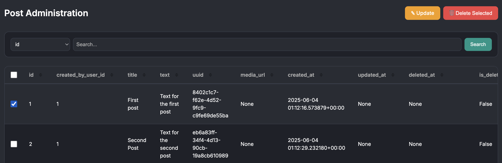

---

## Search and Filtering

### Basic Search

Use the search interface to find specific records quickly:

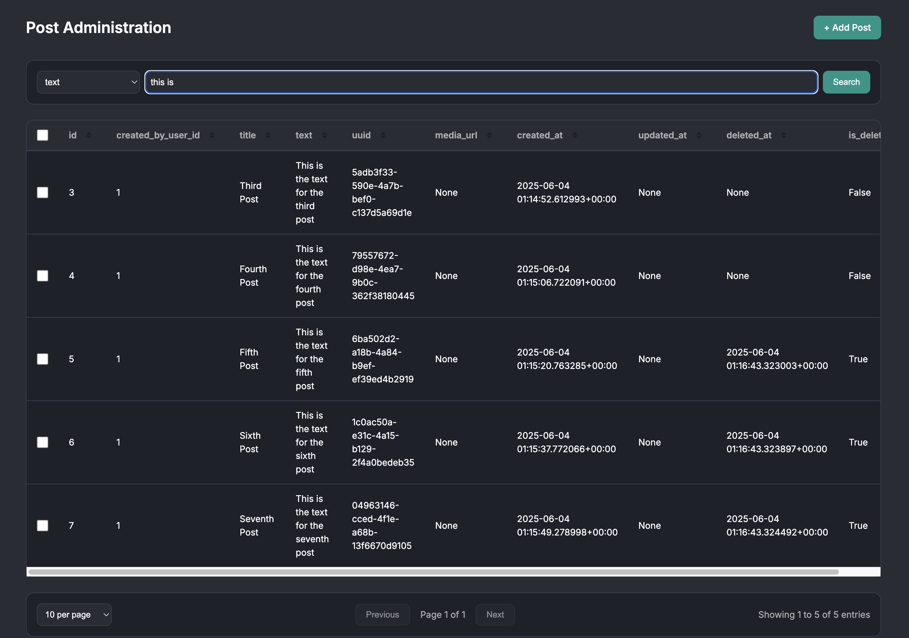

#### How to Search

1. **Select the column** to search in from the dropdown
2. **Enter your search term** in the text field
3. **Search automatically** as you type (with a short delay)
4. **Click "Search"** for immediate results

#### Search Behavior

- **Partial matching**: Finds records containing your search term
- **Case insensitive**: "Admin" matches "admin", "ADMIN", etc.
- **Real-time results**: Updates as you type
- **Persistent**: Search terms remain when you change pages

### Column-Specific Searching

Different column types support different search patterns:

- **Text fields**: Partial word matching
- **Email fields**: Search by domain (@company.com) or username
- **Number fields**: Exact or partial number matching
- **Date fields**: Search by date patterns
- **Choice fields**: Search by specific option values

---

## Pagination

### Managing Large Datasets

When you have many records, pagination helps you navigate efficiently:

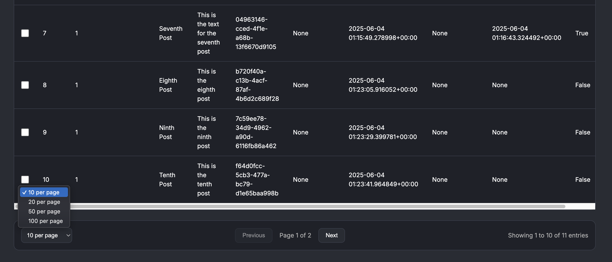

#### Pagination Features

**Records Per Page:**

- Choose from 10, 20, 50, or 100 records per page
- Changes apply immediately
- Preserves your current search and sort settings

**Page Navigation:**

- **Previous/Next buttons** for page-by-page navigation
- **Page indicator** shows current position (e.g., "Page 2 of 15")
- **Automatic adjustment** if you delete records from current page

#### Smart Pagination Behavior

- **Maintains search terms** when changing pages
- **Preserves sort order** across all pages
- **Adjusts current page** if necessary after deletions
- **Shows filtered totals** when search is active

---

## Form Handling

### Understanding Auto-Generated Forms

CRUDAdmin creates forms automatically from your Pydantic schemas.

#### Field Type Examples

**Text Input Fields:**
```python
# Schema definition
username: str = Field(..., min_length=3, max_length=50)
# Generates: Username* [text input] (required field marked with *)
```

**Email Fields:**
```python
# Schema definition
email: EmailStr
# Generates: Email* [email input] (with validation)
```

**Select Dropdowns:**
```python
# Schema definition
role: str = Field(..., pattern="^(admin|user|moderator)$")
# Generates: Role* [dropdown] with options
```

**Boolean Checkboxes:**
```python
# Schema definition
is_active: bool = True
# Generates: ☑ Active (checkbox, checked by default)
```

### Form Validation

#### Validation Feedback

- **Required fields** marked with asterisk (*)
- **Format validation** for emails, patterns, etc.
- **Length restrictions** enforced (min/max characters)
- **Real-time feedback** as you fill fields

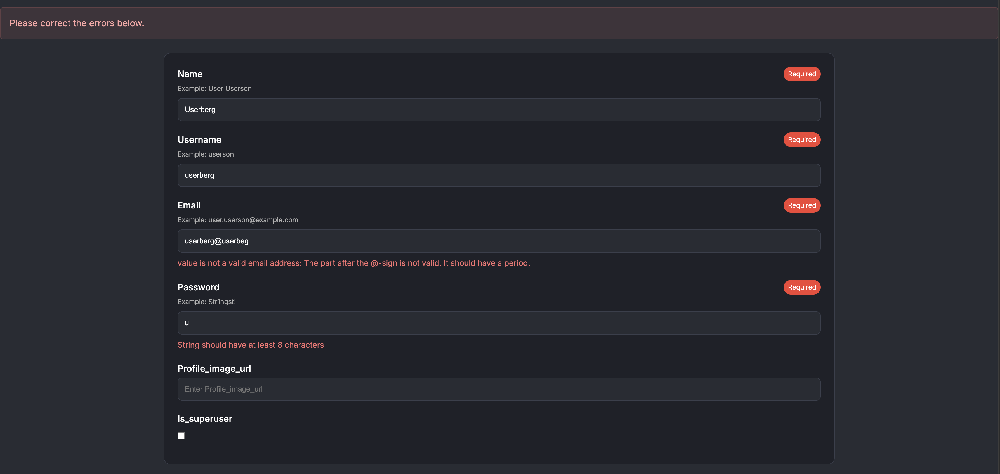

#### Error Handling

- **Field-level errors** appear below problematic fields
- **Clear error messages** explain what needs to be fixed
- **Form-level errors** show at the top for general issues
- **Automatic focus** moves to first error field

---

## Bulk Operations

### Working with Multiple Records

Select multiple records to perform bulk actions:

#### Selecting Records

- **Individual selection**: Check boxes next to specific records
- **Select all**: Use the header checkbox to select all visible records
- **Partial selection**: Mix individual selections as needed

#### Available Bulk Operations

- **Bulk deletion**: Delete multiple records at once
- **Batch updates**: Update multiple records simultaneously (if configured)
- **Export operations**: Download selected records (if enabled)

#### Bulk Deletion Process

1. **Select target records** using checkboxes
2. **Click "Delete Selected"** (appears when multiple items selected)
3. **Review selection** in confirmation dialog
4. **Confirm deletion** to remove all selected records

**Important**: Bulk operations cannot be undone, so review your selection carefully before confirming.

---

## Management Features

### System Health Monitoring

Access system status through the Management section:

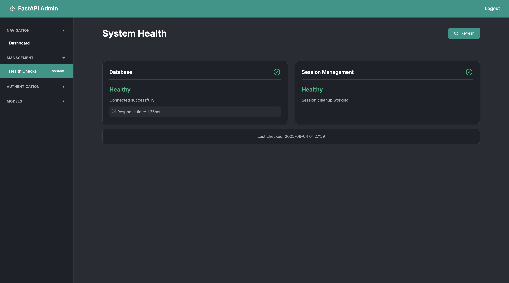

- **Database connectivity**: Connection status and response times
- **Session storage**: Health of your session backend (memory/Redis/etc.)
- **Event system**: Status of audit logging (if enabled)
- **Manual refresh**: Update health checks on demand

### Event Logs (if enabled)

Monitor admin activity through the event log system:

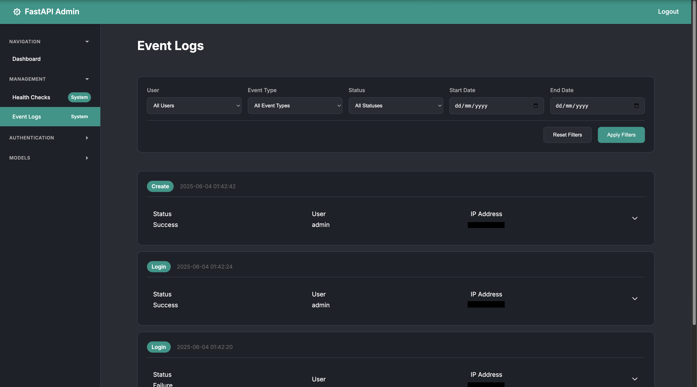

#### Event Tracking

- **User actions**: Login, logout, record changes
- **CRUD operations**: Create, update, delete activities
- **System events**: Authentication failures, system errors
- **Filterable history**: Search by user, date range, event type

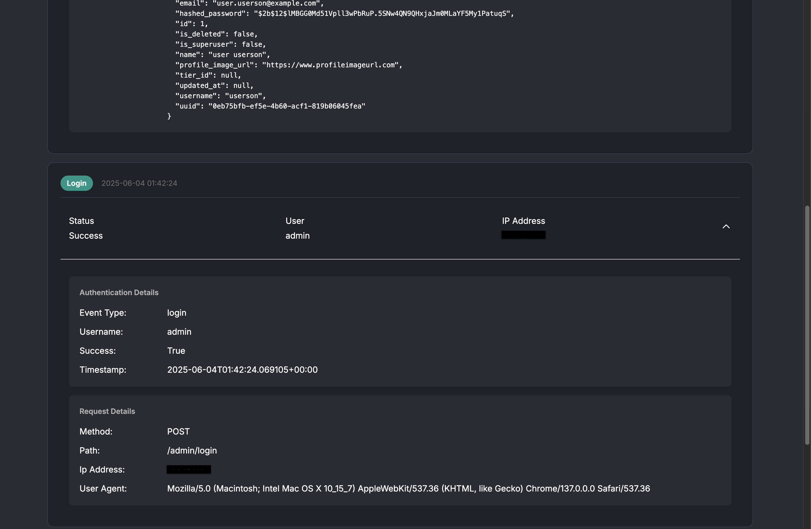

---

## Next Steps

After mastering the basic interface operations, explore the **[Advanced Topics](../advanced/overview.md)** section for production features and sophisticated configurations.

The admin interface provides everything you need for daily data management. With practice, you'll develop efficient workflows that make managing your application data quick and reliable. 